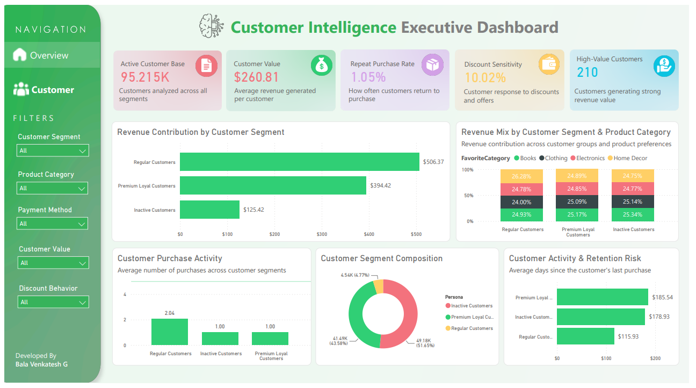
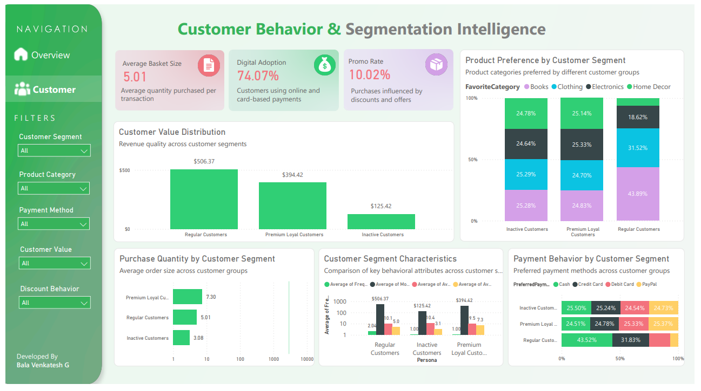

# 🚀 Advanced Customer Segmentation & Behavioral Analytics

> AI-powered customer intelligence platform built using Machine Learning, Behavioral Analytics, and Power BI.


---

# 📌 Project Overview

Understanding customer behavior is critical for improving customer retention, increasing revenue, and delivering personalized experiences.

This project applies **Machine Learning-based Customer Segmentation** and **Behavioral Analytics** on retail transaction data to identify customer personas, analyze purchasing patterns, and generate actionable business insights.

The solution combines:

✅ RFM Analysis

✅ Feature Engineering

✅ PCA (Dimensionality Reduction)

✅ K-Means Clustering

✅ DBSCAN Clustering

✅ Behavioral Analytics

✅ Interactive Power BI Dashboards

---

# 🎯 Business Problem

Businesses often struggle to answer questions such as:

- Who are our most valuable customers?
- Which customers are likely to become inactive?
- How do different customer groups behave?
- Which segments respond to promotions?
- How can marketing campaigns be personalized?

This project addresses these challenges using data-driven customer intelligence.

---

# 📊 Dataset Information

### Retail Transaction Dataset

The dataset contains:

- Customer Information
- Product Categories
- Purchase Quantity
- Pricing Information
- Discounts
- Payment Methods
- Transaction History

### Dataset Size

| Metric | Value |
|----------|----------|
| Records | 100,000+ |
| Customers | 95,000+ |
| Features | 10+ |

---

# ⚙️ Project Workflow

```text
Retail Transaction Dataset
            ↓
      Data Cleaning
            ↓
   Feature Engineering
            ↓
        RFM Analysis
            ↓
            PCA
            ↓
     K-Means Clustering
            ↓
      DBSCAN Analysis
            ↓
 Customer Persona Creation
            ↓
 Behavioral Analytics
            ↓
    Power BI Dashboard
```

---

# 🧠 Machine Learning Pipeline

## 1️⃣ Data Understanding

- Dataset Exploration
- Data Quality Validation
- Missing Value Checks
- Data Type Verification

---

## 2️⃣ Feature Engineering

### RFM Features

| Feature | Description |
|----------|----------|
| Recency | Days since last purchase |
| Frequency | Number of purchases |
| Monetary | Customer spending value |

### Behavioral Features

| Feature | Description |
|----------|----------|
| AvgQuantity | Average quantity purchased |
| AvgDiscount | Average discount received |
| PreferredPayment | Most used payment method |
| FavoriteCategory | Most purchased category |
| AvgPurchaseInterval | Average time between purchases |

---

## 3️⃣ PCA (Principal Component Analysis)

Used PCA to:

- Reduce dimensionality
- Remove feature redundancy
- Improve clustering performance
- Enhance visualization

---

## 4️⃣ K-Means Clustering

Applied K-Means clustering to identify customer personas.

### Segments Identified

| Segment | Description |
|----------|----------|
| ⭐ Premium Loyal Customers | High-value customers with strong spending behavior |
| 👥 Regular Customers | Consistent and active customer group |
| 🔄 Inactive Customers | Low-engagement customers with retention potential |

---

## 5️⃣ DBSCAN Analysis

Used DBSCAN to:

- Identify behavioral outliers
- Detect unusual customer patterns
- Validate customer segmentation

---

# 📈 Executive Dashboard

## Customer Intelligence Executive Dashboard

### Key KPIs

📌 Active Customers

📌 Customer Value

📌 Repeat Purchase Rate

📌 Discount Sensitivity

📌 High-Value Customers

### Business Insights

- Revenue Contribution by Segment
- Customer Activity & Retention Risk
- Segment Distribution Analysis
- Customer Value Analysis

### Dashboard Preview



---

# 🔍 Behavioral Intelligence Dashboard

## Customer Behavior & Segmentation Intelligence

### Key KPIs

📌 Average Basket Size

📌 Digital Payment Adoption

📌 Promotional Purchase Rate

📌 Average Purchase Gap

### Behavioral Analytics

- Product Preference Analysis
- Payment Behavior Analysis
- Purchase Quantity Analysis
- Customer Persona Comparison
- Segment Performance Analysis

### Dashboard Preview



---

# 📊 Key Findings

### Customer Segmentation

✅ Three distinct customer personas were identified using Machine Learning.

✅ Regular Customers represent the largest customer segment.

---

### Revenue Insights

💰 Regular Customers contribute the highest customer value.

💰 Premium Loyal Customers maintain strong spending despite lower purchase frequency.

💰 Inactive Customers generate the lowest revenue contribution.

---

### Customer Behavior

🛒 Customers purchase an average of 5 products per transaction.

💳 Digital payment adoption exceeds 70%.

🏷️ Promotions influence approximately 10% of purchasing behavior.

---

### Product Preferences

📦 Product category preferences vary significantly across customer segments.

📦 Different customer groups exhibit distinct purchasing patterns.

---

### Retention Opportunities

🎯 Inactive Customers represent the biggest retention opportunity.

🎯 Repeat purchasing behavior is strongest among Regular Customers.

---

# 💡 Business Recommendations

### Customer Retention

- Re-engage inactive customers through targeted campaigns.
- Monitor customers showing declining engagement.

### Loyalty Programs

- Reward Premium Loyal Customers.
- Introduce personalized loyalty benefits.

### Marketing Strategy

- Create segment-specific promotions.
- Personalize product recommendations.

### Payment Experience

- Expand digital payment incentives.
- Encourage cash users to adopt digital channels.

---

# 🛠️ Tech Stack

### Programming

- Python
- Pandas
- NumPy

### Machine Learning

- Scikit-Learn
- PCA
- K-Means
- DBSCAN

### Visualization

- Matplotlib
- Seaborn
- Power BI

---

# 📂 Project Structure

```text
advanced-customer-segmentation-ml/

├── data/
├── notebooks/
├── models/
├── dashboard/
├── images/
├── reports/
├── README.md
├── requirements.txt
└── LICENSE
```

---

# 📁 Notebooks

| Notebook | Purpose |
|-----------|-----------|
| 01_data_understanding | Dataset exploration |
| 02_rfm_feature_engineering | Feature engineering |
| 03_pca_preprocessing | PCA implementation |
| 04_kmeans_clustering | Customer segmentation |
| 05_customer_persona_analysis | Persona creation |
| 06_dbscan_clustering | Outlier analysis |
| 07_dashboard_visualization | Dashboard preparation |

---

# 🎯 Project Impact

This project demonstrates:

✅ Data Cleaning & Preparation

✅ Feature Engineering

✅ Machine Learning

✅ Customer Segmentation

✅ Behavioral Analytics

✅ Business Intelligence

✅ Power BI Dashboarding

✅ Business Storytelling

---

# 👨‍💻 Author

**Bala Venkatesh**

Big Data Engineer | Analytics Enthusiast

### Connect

- LinkedIn
- GitHub

---

⭐ If you found this project useful, consider giving it a star!
